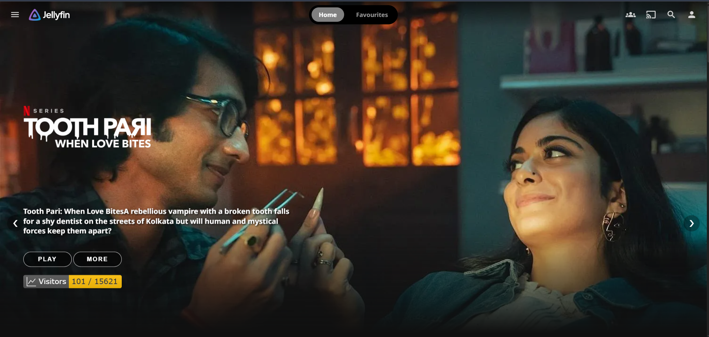
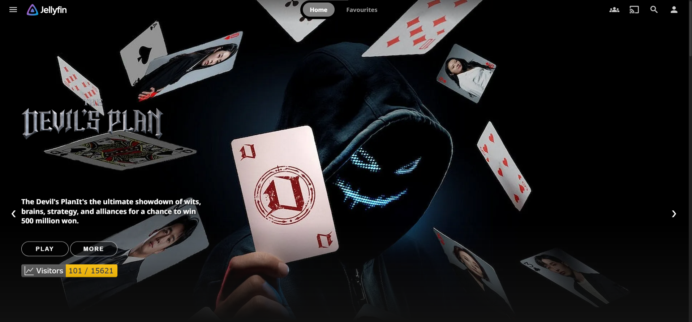

# 🍇 Jellyfin Home Swiper UI & Theme

<div align="center">


**A modern, cinematic banner carousel and sleek dark theme tailored specifically for Jellyfin Web.**

[📌 Overview](#-project-overview) • [✨ Features](#-key-features) • [🛠️ Installation](#%EF%B8%8F-installation-guide) • [📸 Previews](#-screenshots--previews) • [🧪 Compatibility](#-tested-compatibility) • [💖 Support](#-support--sponsorship)

</div>

---

## 📌 Project Overview

**Jellyfin Home Swiper UI** transforms the standard Jellyfin home interface (`#!/home`) into an interactive, streaming-grade media hub. It communicates with Jellyfin's internal API client to showcase recent and trending movies and TV series using high-resolution backdrops, transparent logos, synopsis, and touch-responsive swipe gestures.

In addition to the banner slider, this module provides an optimized dark CSS theme (`style.css`) that refines cards, buttons, dialogs, and typography for a cleaner viewing experience.

---

## ✨ Key Features

- 🎞️ **Cinematic Banner Carousel:** Smooth kinetic sliding between featured titles with auto-rotation every 6–8 seconds.
- 🎨 **Bespoke Jellyfin Theme:** Custom `style.css` dark theme with rounded cards, frosted glass accents, and improved contrast.
- 📱 **Fully Fluid Responsiveness:** Responsive breakpoints optimized for 4K TVs, ultrawide desktops, tablets, and smartphones.
- ⚡ **Multi-Version Flexibility:** Includes `main-v1.js`, `main-v2.js`, and `main-v3.js` inside `jellyfin/Version/` to easily match your visual preferences.
- 🚀 **Zero Server Binary Modifications:** Integrates entirely through web client frontend assets (`index.html`) without altering the Jellyfin core server.
- ⏸️ **Hover & Focus Protection:** Automatically pauses slide cycles when hovering or tapping on titles for relaxed reading.

---

## 🛠️ Installation Guide

### Option A: Automated Setup (Linux / Docker Script)
Run the provided setup script inside your Jellyfin container or server environment:

```bash
# Execute the automated deployment script
bash script.sh
```

---

### Option B: Manual Installation (Recommended)

#### Step 1: Copy Files to Jellyfin Web Directory
Copy the entire `jellyfin-crx` folder (or the contents of `Jellyfin/jellyfin/`) into your Jellyfin web root directory:

| Environment | Standard Web Root Path |
| :--- | :--- |
| 🐧 **Linux (Debian / Ubuntu / Arch)** | `/usr/share/jellyfin/web/jellyfin-crx/` |
| 🐳 **Docker (`jellyfin/jellyfin`)** | `/jellyfin/jellyfin-web/jellyfin-crx/` |
| 🪟 **Windows (Standard Install)** | `C:\Program Files\Jellyfin\Server\jellyfin-web\jellyfin-crx\` |
| 🍎 **macOS (Homebrew / App)** | `/usr/local/share/jellyfin/web/jellyfin-crx/` |

#### Step 2: Inject Assets in `index.html`
Open `index.html` in your Jellyfin web directory and paste this asset block right before the closing `</head>` tag:

```html
<!-- Jellyfin Swiper UI Assets -->
<link rel="stylesheet" id="theme-css" href="jellyfin-crx/style.css" type="text/css" media="all" />
<script src="jellyfin-crx/jquery-3.6.0.min.js"></script>
<script src="jellyfin-crx/md5.min.js"></script>
<script src="jellyfin-crx/main.js"></script>
```

#### Step 3: Restart Jellyfin
Restart the Jellyfin service or container to ensure new asset routes are loaded:

```bash
# Systemd (Linux)
sudo systemctl restart jellyfin

# Docker
docker restart <jellyfin_container_name>
```

#### Step 4: Hard Refresh
Open your browser, navigate to your Jellyfin web client, and press `Ctrl + F5` (or `Cmd + Shift + R` on Mac).

---

## 📸 Screenshots & Previews

<div align="center">

### 🍿 Jellyfin Home Carousel Banner
  

### 🎨 Dark Theme & Detail Overview
  

### 📱 Responsive Mobile & Tablet Layout
  

### 🌟 High-Definition Logo & Backdrop Rendering
  

</div>

---

## 🧪 Tested Compatibility

| Platform / Browser | Version | Status |
| :--- | :--- | :---: |
| **Jellyfin Web Server** | 10.8.x → 10.11.x+ | ✅ Fully Supported |
| **Google Chrome / Chromium** | Latest | ✅ Verified |
| **Mozilla Firefox** | Latest | ✅ Verified |
| **Apple Safari (macOS / iOS)** | Latest | ✅ Verified |
| **Microsoft Edge** | Latest | ✅ Verified |
| **Android / iOS Browsers** | Mobile Web | ✅ Verified |

---

## 💡 Pro Tips

> [!TIP]
> **Server Updates:** When updating Jellyfin to a new version, `index.html` may be replaced. Keep your asset folder intact and simply re-add the 4 asset lines to `index.html`.

> [!NOTE]
> **Switching Versions:** To switch between V1, V2, or V3 carousel styles, simply copy the desired file from `jellyfin/Version/` (e.g., `main-v2.js`) and overwrite `jellyfin-crx/main.js`.

---

## 💖 **Support & Sponsorship**

<p align="center">
  <b>Hello Viewers & Developers! 🌟</b><br/>
  If you find this project, custom UI components, or media streaming scripts helpful in your own setup, here are several ways you can support continuous development, hosting, and server maintenance costs:
</p>

<br/>

<div align="center">

| Payment Method | Network / Details | Action |
| :--- | :--- | :---: |
| 💎 **Crypto (SOL / USDT / Multi-Chain)** | `9YEThZFaqmqPbPJt8f4jLxPKELMzUmgncsrqvCv44BjE` | <a href="#crypto-wallet"></a> |
| 📱 **bKash (Personal)** | Send Money (Bangladesh) — Contact on Telegram | <a href="https://t.me/Md_Sohag_Rana" target="_blank"></a> |
| ⚡ **Nagad (Personal)** | Send Money (Bangladesh) — Contact on Telegram | <a href="https://t.me/Md_Sohag_Rana" target="_blank"></a> |
| ☕ **Buy Me A Coffee** | Global Creator & Developer Support | <a href="https://rootbd.xyz" target="_blank"></a> |
| ⭐ **Star Repositories** | Free Community Support on GitHub | <a href="https://github.com/sohag1192/Emby-Home-Swiper-UI" target="_blank"></a> |

</div>

<br/>

<a id="crypto-wallet" name="crypto-wallet"></a>

### 💎 **Crypto Wallet Address (SOL / USDT / Multi-Chain):**

```bash
9YEThZFaqmqPbPJt8f4jLxPKELMzUmgncsrqvCv44BjE
```

> [!NOTE]
> 💡 *Hover over or tap the code box above and click the **Copy (📋)** button in the top-right corner to copy the wallet address instantly.*

<br/>

---

## 🤝 Contributing & Contact

📬 **Email:** [sohag1192@gmail.com](mailto:sohag1192@gmail.com)  
💬 **Telegram:** [@Md_Sohag_Rana](https://t.me/Md_Sohag_Rana)  
🌐 **Repository:** [sohag1192/Emby-Home-Swiper-UI](https://github.com/sohag1192/Emby-Home-Swiper-UI)

---

## 📜 Credits & Acknowledgments

- [frostyleave/emby-crx-for-jellyfin](https://github.com/frostyleave/emby-crx-for-jellyfin) — Original Jellyfin web adaptation.
- [Nolovenodie/emby-crx](https://github.com/Nolovenodie/emby-crx) — Foundational inspiration.

---

## 📄 License

Distributed under the [MIT License](../LICENSE). Feel free to use and modify with attribution.

