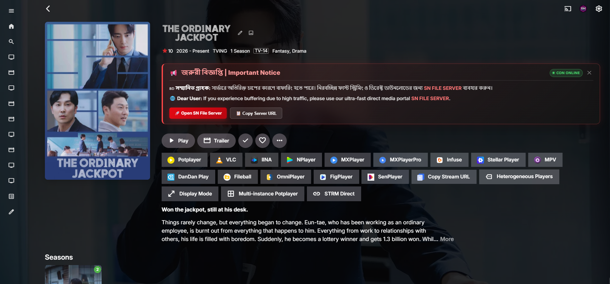

# 🚀 Emby & Jellyfin Home Swiper UI

<div align="center">


**Transform your Emby and Jellyfin home screen into a stunning, modern media showcase with dynamic banners, ratings, external player launching, and animated announcements.**

[✨ Features](#-key-features) • [📸 Previews](#-visual-previews) • [📂 Modules](#-repository-structure--modules) • [🛠️ Installation](#%EF%B8%8F-installation-guide) • [⚙️ Configuration](#%EF%B8%8F-customization--configuration) • [🧪 Troubleshooting](#-troubleshooting--faq) • [📬 Contact](#-contributing--contact)

</div>

---

## 📖 Overview

**Emby Home Swiper UI** replaces the default library grid on your Emby & Jellyfin home page (`#!/home`) with an interactive, cinematic **Swiper banner carousel**. It dynamically queries your media server's native APIs to showcase the newest, trending, and top-rated movies and TV series — with zero external library overhead for core functionality.

Beyond the home banner carousel, this all-in-one repository also provides:
- 🌟 **Community Ratings & Production Year Badges**
- 🎬 **External Player Integration** (PotPlayer, MPV, VLC)
- 📢 **Item Detail Announcement & Notice Boxes** (`text_sider`)
- 🎨 **Dedicated Jellyfin Web Theme & Carousel**
- ⚡ **1-Click Shell and Batch Setup Scripts**

---

## 📸 Visual Previews

### 🎞️ Emby Home Swiper Carousel (V2)


### 🍿 Jellyfin Home Carousel & Theme


### 🎬 External Player Integration (`emby-player`)


### 📢 Item Detail Notice & Announcement Box (`text_sider`)


---

## ✨ Key Features

| Category | Feature | Description |
| :--- | :--- | :--- |
| 🚀 **Performance** | **Ultra-Lightweight** | Pure native JavaScript utilizing Emby/Jellyfin internal `ApiClient`. Minimal memory footprint. |
| 🖼️ **Visuals** | **High-Res Backdrops & Logos** | Automatically renders clear transparent PNG logos, backdrop fanart, taglines, and synopsis. |
| ⭐ **Metadata** | **Rating & Year Badges** | (V2) Displays Community Rating (e.g., ⭐ 8.5/10), Production Year (e.g., 2024), and Official Content Rating (PG-13, TV-MA). |
| 🔄 **Animation** | **Auto-Slide & Pause on Hover** | Rotates slides smoothly every 6–8 seconds; automatically pauses when hovering for uninterrupted reading. |
| 📱 **Responsiveness** | **Fully Responsive Layout** | Adaptive styling seamlessly scales between 4K TVs, Ultrawide monitors, Laptops, Tablets, and Smartphones. |
| 🎯 **Navigation** | **Interactive Controls** | Next / Previous buttons, clickable pagination bullet dots, and keyboard/touch swipe navigation. |
| 🍿 **Playback** | **External Player Routing** | Launch streams straight into PotPlayer (Windows), MPV (via `mpv-handler`), VLC, and MX Player. |
| 📢 **Announcements** | **Detail Page Alert Box** | Inject customizable multilingual notice banners on media detail pages with smooth kinetic animation. |
| 🛡️ **Reliability** | **Graceful Error Handling** | Fallback backdrops and error catches prevent layout breaks when metadata or fanart is missing. |

---

## 📂 Repository Structure & Modules

```
Emby-Home-Swiper-UI/
├── home-swiper-v2/         # 🌟 Advanced Swiper with Ratings, Year & UI upgrades
│   ├── home-swiper.js      # Clean Swiper script
│   ├── home_rating with year.js # Swiper with Community Rating ⭐ & Year 📅 badges
│   └── img/                # V2 Screenshots
├── home-sider-v1/          # 📦 Classic lightweight home banner slider
│   ├── home.js             # V1 base swiper logic
│   └── img/                # V1 Screenshots
├── Jellyfin/               # 🍇 Dedicated Jellyfin Web integration
│   ├── jellyfin/           # Styles, main.js, jQuery & MD5 dependencies
│   ├── script.sh           # Auto setup script for Jellyfin Web
│   └── img/                # Jellyfin Screenshots
├── emby-player/            # 🎬 External player launcher (PotPlayer, MPV, VLC)
│   ├── emby_launch_player.js
│   └── README.md
├── text_sider/             # 📢 Media detail page announcement & notice boxes
│   ├── Text Slider Box.html
│   ├── Text No Slider Box.html
│   └── Text Warning Box.html
├── script.sh               # 🐧 Linux/Docker automatic installation script
├── setup-swiper.sh         # 🐧 Enhanced Linux/Docker injection script
├── download-homejs.bat     # 🪟 Windows PowerShell auto-download script
├── upload.bat              # 🛠️ Git upload helper script
└── README.md               # 📖 Main documentation
```

---

## 🛠️ Installation Guide

Choose your platform and preferred installation method below:

### 🌟 Option 1: Emby Server (Manual Setup — Recommended)

#### Step 1: Locate your Emby Web dashboard directory
Find the `dashboard-ui` folder on your server:

- **Synology NAS:**
  ```text
  /volume1/@appstore/EmbyServer/system/dashboard-ui/
  ```
- **Docker (`lovechen/embyserver` or official Emby Docker):**
  ```text
  /system/dashboard-ui/
  # or locate via: docker exec -it <container_id> find / -name "index.html"
  ```
- **Linux (Debian/Ubuntu):**
  ```text
  /opt/emby-server/system/dashboard-ui/
  ```
- **Windows:**
  ```text
  C:\Users\<YourUser>\AppData\Roaming\Emby-Server\system\dashboard-ui\
  ```

#### Step 2: Download & Copy the Script
1. Choose your preferred version: **[home-swiper-v2/home_rating with year.js](home-swiper-v2/home_rating%20with%20year.js)** *(⭐ Ratings & Year Edition - Recommended)*, **[home-swiper-v2/home-swiper.js](home-swiper-v2/home-swiper.js)** *(Minimal)*, or **[home-sider-v1/home.js](home-sider-v1/home.js)** *(Classic)*.
2. Rename the selected file to `home.js` and copy it directly into your `dashboard-ui/` directory (or inside a subfolder like `dashboard-ui/emby-crx/home.js`).

#### Step 3: Inject the Script in `index.html`
Open `dashboard-ui/index.html` with a text editor and add the script tag just before the closing `</head>` or `</body>` tag:

```html
<!-- Emby Home Swiper UI -->
<script src="home.js" defer></script>
```
*(If placed in a subfolder like `emby-crx/home.js`, use `<script src="emby-crx/home.js" defer></script>`)*

#### Step 4: Refresh & Enjoy
Restart your Emby server or clear your browser cache and refresh (`Ctrl + F5`). Navigate to `#!/home` to see your new Swiper banner in action!

---

### ⚡ Option 2: Emby Automated Setup (Linux / Docker)

Run the included automated setup script in your `dashboard-ui` directory:

```bash
# Navigate to your dashboard-ui folder
cd /path/to/emby/system/dashboard-ui/

# Download and execute the automated setup script
curl -sSL https://raw.githubusercontent.com/sohag1192/Emby-Home-Swiper-UI/main/setup-swiper.sh | bash
```

---

### 🍇 Option 3: Jellyfin Server Installation

1. Copy the contents of the `Jellyfin/jellyfin/` directory into your Jellyfin web root folder:
   - **Linux:** `/usr/share/jellyfin/web/`
   - **Windows:** `C:\Program Files\Jellyfin\Server\jellyfin-web\`
   - **Docker:** `/jellyfin/jellyfin-web/`
2. Edit `index.html` in your Jellyfin web directory and insert the following before `</head>`:

```html
<!-- Jellyfin Swiper UI Assets -->
<link rel="stylesheet" id="theme-css" href="jellyfin-crx/style.css" type="text/css" media="all" />
<script src="jellyfin-crx/jquery-3.6.0.min.js"></script>
<script src="jellyfin-crx/md5.min.js"></script>
<script src="jellyfin-crx/main.js"></script>
```
3. Restart Jellyfin:
```bash
sudo systemctl restart jellyfin
```

---

### 🎬 Option 4: External Player Launcher (`emby-player`)

Route media playback directly to third-party desktop players (PotPlayer, MPV, VLC):

1. Copy [`emby-player/emby_launch_player.js`](emby-player/emby_launch_player.js) into your `dashboard-ui/emby-player/` folder.
2. In `dashboard-ui/index.html`, add the following right before `</body>`:

```html
<!-- External Player Hook -->
<script src="emby-player/emby_launch_player.js" defer></script>
```

> **Requirements for External Players:**
> - **PotPlayer (Windows):** Ensure PotPlayer is installed. Soft subtitles and direct streams are supported out-of-the-box.
> - **MPV (Windows/macOS/Linux):** Requires [mpv-handler](https://github.com/akiirui/mpv-handler) protocol handler installed locally.

---

### 📢 Option 5: Item Detail Notice Box (`text_sider`)

To display announcement banners or server status warnings on media item detail pages (`#!/item?id=...`):

1. Open [`text_sider/Text Slider Box.html`](text_sider/Text%20Slider%20Box.html) (or `Text Warning Box.html`).
2. Copy the `<style>` and `<script>` blocks into your `dashboard-ui/index.html` right before `</body>`.
3. Customize your alert title and message text in the code as desired.

---

### 🧩 Option 6: Browser Extension (Tampermonkey / Violentmonkey)

If you do not have root/admin access to modify the server's files, you can inject the script on your client side:

1. Install **Tampermonkey** or **Violentmonkey** extension in your browser.
2. Create a new UserScript with the following header:
```javascript
// ==UserScript==
// @name         Emby Home Swiper UI
// @namespace    https://github.com/sohag1192/Emby-Home-Swiper-UI
// @version      2.0
// @description  A dynamic banner carousel for Emby Web
// @match        *://*/web/index.html*
// @match        *://*/*/web/index.html*
// @require      https://raw.githubusercontent.com/sohag1192/Emby-Home-Swiper-UI/main/home-swiper-v2/home_rating%20with%20year.js
// @grant        none
// ==/UserScript==
```

---

## ⚙️ Customization & Configuration

You can easily adjust settings inside `home.js` / `home-swiper.js`:

```javascript
// In class HomeSwiper.start():

this.itemQuery = {
    ImageTypes: "Primary,Backdrop",
    EnableImageTypes: "Primary,Backdrop,Banner,Logo",
    IncludeItemTypes: "Movie,Series", // Filter item types (e.g. "Movie", "Series", "BoxSet")
    SortBy: "DateCreated",            // Sort order: "DateCreated", "PremiereDate", "CommunityRating", or "Random"
    SortOrder: "Descending",
    Recursive: true,
    Limit: 10,                        // Maximum number of banner slides
    Fields: "Taglines,Overview,ParentId,DateCreated,PremiereDate,ProductionYear,CommunityRating,OfficialRating"
};

this.slideDelay = 6000;              // Slide rotation duration in milliseconds (e.g., 6000 = 6 seconds)
this.showItemNum = 9;                // Number of items to display
```

---

## 🧪 Troubleshooting & FAQ

<details>
<summary><b>1. The banner is not appearing on the home page</b></summary>

- **Check the URL Route:** The script only triggers on the home route: `#!/home`. Make sure you are on the main dashboard home page.
- **Open Developer Tools (`F12`):** Check the **Console** tab for any red errors.
- **Verify `ApiClient` Availability:** In the browser console, type:
  ```javascript
  console.log(ApiClient);
  ```
  If `ApiClient` is undefined, make sure the script is loaded with `defer` or placed right before `</body>`.
- **Manually Initialize:** Test if the swiper initializes by typing in the console:
  ```javascript
  HomeSwiper.init();
  ```
</details>

<details>
<summary><b>2. Images or logos are missing / blank</b></summary>

- Check if your media items have backdrops and clear logos identified in Emby/Jellyfin metadata.
- If an item doesn't have a Logo, the script will fall back gracefully to text title or primary poster fanart.
</details>

<details>
<summary><b>3. Changes disappear after Emby or Jellyfin server updates</b></summary>

- Server updates can sometimes overwrite `index.html`.
- Keep a backup of your `home.js` script and simple injection line, or run `setup-swiper.sh` again after server updates.
</details>

<details>
<summary><b>4. How do I clear cache after updating scripts?</b></summary>

- Perform a hard refresh: `Ctrl + Shift + R` (Windows/Linux) or `Cmd + Shift + R` (macOS).
- On mobile devices, clear browser cached site data.
</details>

---

## 🧪 Tested Compatibility

| Platform / Browser | Version | Status |
| :--- | :--- | :---: |
| **Emby Web Client** | 4.9.1.80 – 4.10.0.40+ | ✅ Supported (Tested OK) |
| **Emby Server / Web** | Version 4.10.0.40 (`version=4.10.0.40`) | ✅ Tested & Working (OK) |
| **Jellyfin Web Client** | 10.8.x – 10.11.x+ | ✅ Supported |
| **Google Chrome / Chromium** | Latest | ✅ Supported |
| **Mozilla Firefox** | Latest | ✅ Supported |
| **Microsoft Edge** | Latest | ✅ Supported |
| **Apple Safari (macOS / iOS)** | Latest | ✅ Supported |
| **Mobile Browsers (Android / iOS)**| Responsive View | ✅ Supported |

> [!NOTE]
> **Compatibility Verified:** Tested and confirmed working on Emby Web / Server **Version [4.10.0.40]** (`version=4.10.0.40`).


---

## 🤝 Contributing & Contact

Contributions, bug reports, feature suggestions, and pull requests are welcome!  
If you find a bug or have an idea to improve the UI, feel free to open an [Issue](https://github.com/sohag1192/Emby-Home-Swiper-UI/issues) or submit a [Pull Request](https://github.com/sohag1192/Emby-Home-Swiper-UI/pulls).

<div align="center">

📬 **Email:** [sohag1192@gmail.com](mailto:sohag1192@gmail.com)  
💬 **Telegram:** [@Md_Sohag_Rana](https://t.me/Md_Sohag_Rana)

</div>

---

## 🌟 Support the Project

If you find this project helpful or enjoy using it on your media server, please give it a **⭐ Star** on GitHub! It helps others discover the project and motivates future enhancements.

---

## 📜 Credits & Acknowledgments

- [Nolovenodie/emby-crx](https://github.com/Nolovenodie/emby-crx) — Original foundation and inspiration for Emby Web UI customization.
- [frostyleave/emby-crx-for-jellyfin](https://github.com/frostyleave/emby-crx-for-jellyfin) — Inspiration for Jellyfin web client adaptation.
- [bpking1/embyExternalUrl](https://github.com/bpking1/embyExternalUrl) — Foundational inspiration for the external player invocation logic.

---

## 📄 License

This project is licensed under the [MIT License](LICENSE) — free to use, modify, and distribute with attribution.

