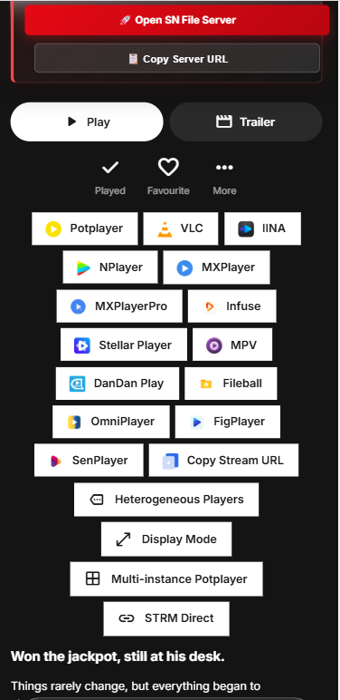

# 🎬 Emby & Jellyfin External Player Integration (`emby-player`)

<div align="center">


**Seamlessly intercept browser media playback and route high-bitrate streams into native desktop & mobile players: PotPlayer, MPV, VLC, MX Player, and IINA.**

[📌 Overview](#-project-overview) • [🚀 Supported Players](#-supported-players--requirements) • [📸 Previews](#-previews) • [🛠️ Deployment](#%EF%B8%8F-deployment-methods) • [⚙️ Power User Tips](#%EF%B8%8F-configuration--power-user-tips) • [💖 Support](#-support--sponsorship)

</div>

---

## 📌 Project Overview

The **Emby External Player Launcher** intercepts play clicks inside the Emby and Jellyfin web clients and invokes dedicated, high-performance standalone media players installed on your system. 

### 🌟 Key Benefits:
- 🚀 **Direct Hardware Acceleration:** Bypasses browser codec limitations to unlock hardware decoding for **4K HEVC, HDR10+, Dolby Vision (P5/P8), and AV1**.
- 🔊 **Uncompressed Audio Passthrough:** Direct bitstream pass-through for TrueHD Atmos, DTS-HD Master Audio, and multi-channel 7.1 audio.
- 💬 **Lossless Subtitle Rendering:** Native PGS/ASS/SSA styling and custom typography rendering without forcing the server into heavy CPU transcoding.
- ⚡ **Zero Transcoding Load:** Saves vast amounts of CPU and GPU transcoding resources on your media server.

> 💡 **Inspiration & Attribution:** Built and modernized based on the excellent work in [bpking1/embyExternalUrl](https://github.com/bpking1/embyExternalUrl).

---

## 🚀 Supported Players & Requirements

| Player | Platform | Protocol / Launch Mechanism | Subtitles & Audio Features |
| :--- | :--- | :--- | :--- |
| **PotPlayer** | 🪟 Windows | `potplayer://` URL protocol | Full external soft subtitle auto-load, multi-audio switching, custom hotkeys. |
| **MPV** | 🪟 Windows / 🐧 Linux / 🍎 macOS | Protocol handler via [mpv-handler](https://github.com/akiirui/mpv-handler) | Minimalist, scriptable, shader post-processing (FSRCNNX, anime upscaling). |
| **VLC Media Player**| 🪟 Windows / 🐧 Linux / 🍎 macOS | `vlc://` URL protocol | Universal compatibility across all desktop operating systems. |
| **IINA** | 🍎 macOS | `iina://weblink` protocol | Polished modern macOS interface with Touch Bar integration. |
| **MX Player / nPlayer** | 📱 Android / iOS | Mobile intent & custom scheme | Direct streaming inside leading mobile hardware players. |

---

## 📸 Previews

<div align="center">

### 🎬 External Player Dialog & Options
  

### 🎛️ Media Selection & Protocol Hook
  

</div>

---

## 🛠️ Deployment Methods

Choose the method best suited for your setup:

### Method 1: Server Injection (Recommended for Server Admins)
* **Advantage:** Zero client-side installation. Any browser visiting your Emby server automatically gets external player launching!

#### Step 1: Copy `emby_launch_player.js`
Place [`emby_launch_player.js`](emby_launch_player.js) into your server's `dashboard-ui/emby-player/` folder:

| Environment | Target Folder |
| :--- | :--- |
| 🐳 **Docker (Official / Lovechen)** | `/system/dashboard-ui/emby-player/` |
| 🐧 **Linux (Debian / Ubuntu)** | `/opt/emby-server/system/dashboard-ui/emby-player/` |
| 🪟 **Windows Server** | `C:\Users\<User>\AppData\Roaming\Emby-Server\system\dashboard-ui\emby-player\` |
| 💾 **Synology NAS** | `/volume1/@appstore/EmbyServer/system/dashboard-ui/emby-player/` |

#### Step 2: Inject Script Tag into `index.html`
Open `dashboard-ui/index.html` and add this line immediately before `</body>`:

```html
<!-- External Player Launcher Hook -->
<script src="emby-player/emby_launch_player.js" defer></script>
```

---

### Method 2: Client-side UserScript (Tampermonkey / Violentmonkey)
* **Advantage:** Works on any Emby or Jellyfin server where you lack administrative filesystem permissions.

1. Install the [Tampermonkey](https://www.tampermonkey.net/) extension in your browser (Chrome, Firefox, Edge, Safari).
2. Create a new UserScript and paste the following script block:

```javascript
// ==UserScript==
// @name         Emby External Player Launcher
// @namespace    https://github.com/sohag1192/Emby-Home-Swiper-UI
// @version      2.0
// @description  Launch PotPlayer, MPV, VLC directly from Emby Web
// @match        *://*/web/index.html*
// @match        *://*/*/web/index.html*
// @require      https://raw.githubusercontent.com/sohag1192/Emby-Home-Swiper-UI/main/emby-player/emby_launch_player.js
// @grant        none
// ==/UserScript==
```

---

## ⚙️ Configuration & Power User Tips

- **Multiple PotPlayer Playback Windows:**  
  By default, PotPlayer is called with `/current` to reuse the existing window. To allow launching multiple playback instances simultaneously, open `emby_launch_player.js` and remove `/current` from the protocol string around line 186.
- **Protocol Association Fix (Windows):**  
  If clicking PotPlayer yields no response, open Windows **Default Apps** settings and ensure `potplayer://` is registered, or perform a repair installation of PotPlayer.
- **AList / 302 Direct Link Proxies:**  
  If your Emby server is backed by cloud storage mounts (e.g. AList or Rclone 302 redirect), external players directly stream the original file with pristine bitrate.

---

## 💖 **Support & Sponsorship**

<p align="center">
  <b>Hello Viewers & Developers! 🌟</b><br/>
  If you find this project, custom UI components, or media streaming scripts helpful in your own setup, here are several ways you can support continuous development, hosting, and server maintenance costs:
</p>

<br/>

<div align="center">

| Payment Method | Network / Details | Action |
| :--- | :--- | :---: |
| 💎 **Crypto (SOL / USDT / Multi-Chain)** | `9YEThZFaqmqPbPJt8f4jLxPKELMzUmgncsrqvCv44BjE` | <a href="#crypto-wallet"></a> |
| 📱 **bKash (Personal)** | Send Money (Bangladesh) — Contact on Telegram | <a href="https://t.me/Md_Sohag_Rana" target="_blank"></a> |
| ⚡ **Nagad (Personal)** | Send Money (Bangladesh) — Contact on Telegram | <a href="https://t.me/Md_Sohag_Rana" target="_blank"></a> |
| ☕ **Buy Me A Coffee** | Global Creator & Developer Support | <a href="https://rootbd.xyz" target="_blank"></a> |
| ⭐ **Star Repositories** | Free Community Support on GitHub | <a href="https://github.com/sohag1192/Emby-Home-Swiper-UI" target="_blank"></a> |

</div>

<br/>

<a id="crypto-wallet" name="crypto-wallet"></a>

### 💎 **Crypto Wallet Address (SOL / USDT / Multi-Chain):**

```bash
9YEThZFaqmqPbPJt8f4jLxPKELMzUmgncsrqvCv44BjE
```

> [!NOTE]
> 💡 *Hover over or tap the code box above and click the **Copy (📋)** button in the top-right corner to copy the wallet address instantly.*

<br/>

---

## 🤝 Contributing & Contact

📬 **Email:** [sohag1192@gmail.com](mailto:sohag1192@gmail.com)  
💬 **Telegram:** [@Md_Sohag_Rana](https://t.me/Md_Sohag_Rana)  
🌐 **Repository:** [sohag1192/Emby-Home-Swiper-UI](https://github.com/sohag1192/Emby-Home-Swiper-UI)

---

## 📄 License

Distributed under the [MIT License](../LICENSE). Feel free to use, modify, and distribute with attribution.


