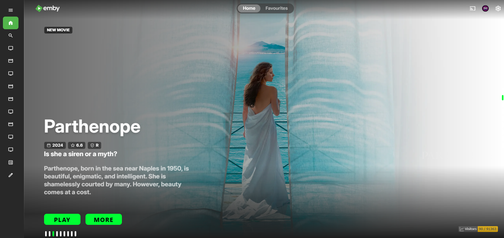

# 🌟 Emby Home Swiper UI (Version 2)

<div align="center">


**The premier, high-performance banner carousel module for Emby Web featuring Community Ratings ⭐, Production Year 📅 badges, transparent title logos, and kinetic animations.**

[✨ Highlights](#-whats-new-in-v2) • [📂 Included Scripts](#-included-scripts) • [🛠️ Installation](#%EF%B8%8F-how-to-install) • [⚙️ Configuration](#%EF%B8%8F-configuration--customization) • [📸 Previews](#-screenshots--previews) • [🧪 Troubleshooting](#-troubleshooting) • [💖 Support](#-support--sponsorship)

</div>

---

## 🚀 What's New in V2

Emby Home Swiper **V2** is a ground-up refinement of the classic banner module, engineered specifically for modern Emby Web releases (including **4.9.x through 4.10.0.40+**):

- ⭐ **Community Ratings & Official Badges:** Automatically queries and renders community ratings (e.g., `⭐ 8.5/10`) alongside official certification badges (`PG-13`, `TV-MA`, `R`).
- 📅 **Production Year Metadata:** Dynamically displays the release or production year prominently next to ratings.
- 🎨 **Cinematic Backdrop Layering:** Enhanced CSS gradient masking prevents text collision while preserving maximum fanart visibility.
- 🔘 **Interactive Pagination Indicators:** Clickable bullet dots with automatic slide synchronization and active state tracking.
- ⚡ **Zero External Dependencies:** Built with pure vanilla ES6 JavaScript utilizing Emby's native `ApiClient` with minimal CPU and memory overhead.
- ⏸️ **Smart Hover & Touch Detection:** Auto-slide rotation automatically pauses when hovering or touching, ensuring an uninterrupted reading experience.
- 🛡️ **Graceful Fallbacks:** Seamlessly falls back to crisp primary fanart and text titles if clear transparent PNG logos or backdrops are missing.

---

## 📂 Included Scripts

| Script File | Best For | Features & Description |
| :--- | :--- | :--- |
| **[`home_rating with year.js`](home_rating%20with%20year.js)** | 🌟 **Recommended** | Full-featured experience with Community Ratings ⭐, Production Year 📅 badges, certification pills, and auto-play controls. |
| **[`home-swiper.js`](home-swiper.js)** | 🎯 **Minimalist** | Clean, distraction-free swiper focusing purely on high-resolution backdrops, transparent logos, and synopsis. |

---

## 🛠️ How to Install

### Step 1: Choose Your Script
Select your preferred script from this directory:
- **`home_rating with year.js`** *(Recommended)*
- **`home-swiper.js`** *(Minimal)*

*(Tip: You can rename your chosen file to `home.js` for cleaner deployment).*

### Step 2: Copy to Your Emby Server Web Directory
Place the script into your server's `dashboard-ui/` directory:

| Operating Environment | Default `dashboard-ui` Path |
| :--- | :--- |
| 🐳 **Docker (Official / Lovechen)** | `/system/dashboard-ui/` |
| 🐧 **Linux (Debian / Ubuntu)** | `/opt/emby-server/system/dashboard-ui/` |
| 🪟 **Windows Server / Desktop** | `C:\Users\<User>\AppData\Roaming\Emby-Server\system\dashboard-ui\` |
| 💾 **Synology NAS** | `/volume1/@appstore/EmbyServer/system/dashboard-ui/` |
| 📦 **QNAP NAS** | `/share/CACHEDEV1_DATA/.qpkg/EmbyServer/system/dashboard-ui/` |

### Step 3: Inject the Script in `index.html`
Open `dashboard-ui/index.html` in a text editor and add the script tag immediately before the closing `</head>` or `</body>` tag:

```html
<!-- Emby Home Swiper V2 -->
<script src="home_rating with year.js" defer></script>
```

> [!TIP]
> If you organized your scripts inside a subdirectory like `dashboard-ui/emby-crx/`, update the path accordingly:
> `<script src="emby-crx/home.js" defer></script>`

### Step 4: Restart & Hard Refresh
1. Restart your Emby server (or restart the container).
2. Open your browser, navigate to the Emby home page (`#!/home`), and execute a hard refresh (`Ctrl + F5` on Windows/Linux or `Cmd + Shift + R` on macOS).

---

## ⚙️ Configuration & Customization

You can fine-tune query parameters and carousel timing directly inside `HomeSwiper.start()` in your JS file:

```javascript
this.itemQuery = { 
    ImageTypes: "Primary,Backdrop", 
    EnableImageTypes: "Primary,Backdrop,Banner,Logo", 
    IncludeItemTypes: "Movie,Series", // Filter item types: "Movie", "Series", "BoxSet"
    SortBy: "DateCreated",            // Sorting options: "DateCreated", "PremiereDate", "CommunityRating", "Random"
    SortOrder: "Descending",          // "Descending" (newest first) or "Ascending"
    Recursive: true, 
    ImageTypeLimit: 1, 
    Limit: 10,                        // Maximum items fetched from your library
    Fields: "Taglines,Overview,ParentId,DateCreated,PremiereDate,ProductionYear,CommunityRating,OfficialRating", 
    EnableUserData: true, 
    EnableTotalRecordCount: false 
};

this.slideDelay = 6000;  // Auto-slide duration in milliseconds (6000 = 6 seconds)
this.showItemNum = 9;    // Number of banners displayed in rotation
```

### 💡 Common Query Presets:

- **Top-Rated Showcase:**
  ```javascript
  SortBy: "CommunityRating",
  SortOrder: "Descending",
  ```
- **Newest Premiere Releases:**
  ```javascript
  SortBy: "PremiereDate",
  SortOrder: "Descending",
  ```
- **Random Discovery Shuffle:**
  ```javascript
  SortBy: "Random",
  ```

---

## 📸 Screenshots & Previews

<div align="center">

### 🎞️ Home Swiper V2 in Action
  

### ⭐ Community Ratings & Production Year Badges
  

### 📱 Responsive Layout & Navigation Controls
  

### 🎬 High-Resolution Backdrop & Logo Rendering
  

</div>

---

## 🧪 Troubleshooting

<details>
<summary><b>1. Banner carousel does not display on the home screen</b></summary>

- **Verify Route:** The script only initializes on the home route (`#!/home`).
- **Check Developer Console (`F12`):** Check the Console tab for any red script loading errors.
- **Verify `ApiClient`:** In the browser console, type `console.log(ApiClient);`. If it returns `undefined`, make sure your `<script>` tag has the `defer` attribute or is placed at the very end of `<body>`.
- **Manual Initialization:** Test manually in console:
  ```javascript
  HomeSwiper.init();
  ```
</details>

<details>
<summary><b>2. Images or logos appear blank</b></summary>

- Ensure your media items have identified metadata with backdrops and clear logos in Emby.
- If an item does not have a logo, the script automatically falls back to clean styled text title.
</details>

<details>
<summary><b>3. Changes reset after server update</b></summary>

- Official server upgrades often overwrite `index.html`. Keep a backup of your script tag or re-add the one-line injection after updates.
</details>

---

## 💖 **Support & Sponsorship**

<p align="center">
  <b>Hello Viewers & Developers! 🌟</b><br/>
  If you find this project, custom UI components, or media streaming scripts helpful in your own setup, here are several ways you can support continuous development, hosting, and server maintenance costs:
</p>

<br/>

<div align="center">

| Payment Method | Network / Details | Action |
| :--- | :--- | :---: |
| 💎 **Crypto (SOL / USDT / Multi-Chain)** | `9YEThZFaqmqPbPJt8f4jLxPKELMzUmgncsrqvCv44BjE` | <a href="#crypto-wallet"></a> |
| 📱 **bKash (Personal)** | Send Money (Bangladesh) — Contact on Telegram | <a href="https://t.me/Md_Sohag_Rana" target="_blank"></a> |
| ⚡ **Nagad (Personal)** | Send Money (Bangladesh) — Contact on Telegram | <a href="https://t.me/Md_Sohag_Rana" target="_blank"></a> |
| ☕ **Buy Me A Coffee** | Global Creator & Developer Support | <a href="https://rootbd.xyz" target="_blank"></a> |
| ⭐ **Star Repositories** | Free Community Support on GitHub | <a href="https://github.com/sohag1192/Emby-Home-Swiper-UI" target="_blank"></a> |

</div>

<br/>

<a id="crypto-wallet" name="crypto-wallet"></a>

### 💎 **Crypto Wallet Address (SOL / USDT / Multi-Chain):**

```bash
9YEThZFaqmqPbPJt8f4jLxPKELMzUmgncsrqvCv44BjE
```

> [!NOTE]
> 💡 *Hover over or tap the code box above and click the **Copy (📋)** button in the top-right corner to copy the wallet address instantly.*

<br/>

---

## 🤝 Contributing & Contact

📬 **Email:** [sohag1192@gmail.com](mailto:sohag1192@gmail.com)  
💬 **Telegram:** [@Md_Sohag_Rana](https://t.me/Md_Sohag_Rana)  
🌐 **Repository:** [sohag1192/Emby-Home-Swiper-UI](https://github.com/sohag1192/Emby-Home-Swiper-UI)

---

## 📄 License

Distributed under the [MIT License](../LICENSE). Feel free to use, customize, and share with attribution.


